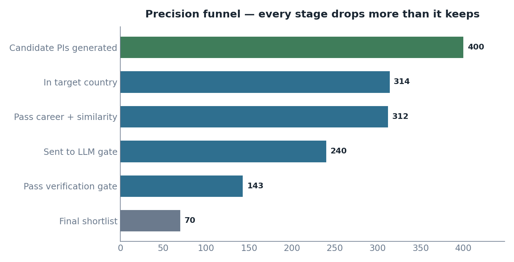
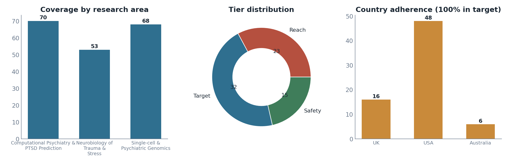
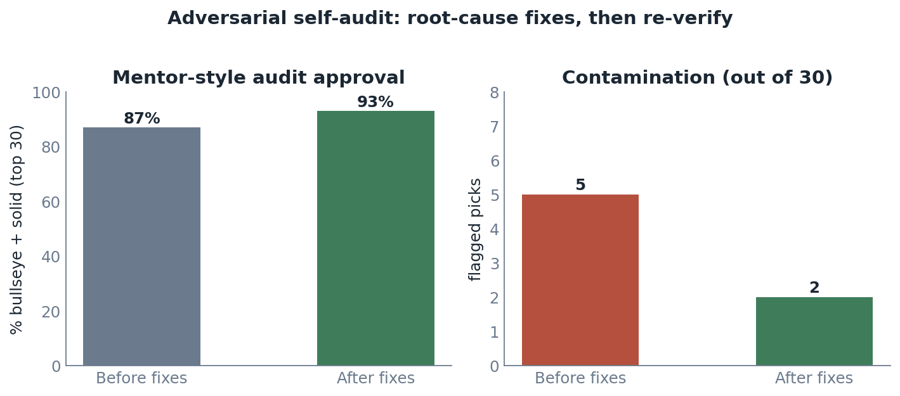

# PhD Shortlist Builder

> Turn a student's research profile into a ranked, evidence-backed shortlist of **PhD supervisors** worth emailing — with no embarrassing mismatches.


Given a student profile (research interests, target countries, background), this system surfaces 50-200 principal investigators (PIs) the student could realistically do a PhD with — each carrying verifiable papers/grants, a tier (reach / target / safety), and a personalised `why_match` that references the professor's *actual* work.

The hard part is not calling an LLM. It is the **data**: finding the right humans, in the right field, at the right career stage, in the right country. The system is engineered end-to-end around one principle — **precision over recall**: every stage would rather drop a borderline match than admit a wrong one.

---

## Architecture

```mermaid
flowchart TD
    A[Student profile JSON] --> B[Profile normalization<br/>LLM: research areas, query terms, nationality]
    B --> C[Candidate generation<br/>OpenAlex works, aggregate to authors]
    C --> D[Country gate<br/>current primary academic home in target country]
    D --> E[Career-stage gate<br/>is this a supervising PI?]
    E --> F[Domain similarity<br/>local embeddings pre-filter]
    F --> G[LLM verification gate<br/>reads real abstracts: domain, region, PI, name-collision]
    G --> H[Rank, tier, per-area coverage balance]
    H --> I[why_match generation<br/>cites specific papers / grants]
    I --> J[(Shortlist JSON<br/>schema-validated)]

    K[Outcomes CSV] --> L[Feedback learner<br/>suppression + success priors]
    L -. adjustments.json .-> H

    OA[OpenAlex] -.-> C
    GR[NIH / UKRI / OpenAIRE] -.-> I
    OR[ORCID] -.-> I

    classDef gate fill:#eef4f8,stroke:#2f6f8f,color:#1b2733;
    class D,E,F,G gate;
```

Candidate generation casts a wide net; a cascade of **cheap filters** (country → career-stage → domain → embedding) narrows it without LLM cost; the **LLM verification gate** then reads each survivor's real abstracts and makes the expensive precision call. Every external call (OpenAlex, grant APIs, ORCID, LLM, embeddings) is cached to disk, so runs are reproducible and warm re-runs take seconds.

---

## How it works

| Stage | What it does | Why |
|---|---|---|
| **Profile normalization** | An LLM expands free-text interests into concrete research areas + search terms and extracts nationality. | Turns messy input into searchable structure. |
| **Candidate generation** | Searches OpenAlex for recent papers per area in the target countries, then rolls them up to authors (stable Author IDs). | OpenAlex gives disambiguated people, papers, institution + country, and a topic taxonomy from one free source. |
| **Country gate** | Keeps only authors whose **current primary academic affiliation** is in a target country. | The country constraint is a hard requirement; resolving the *primary* affiliation prevents out-of-country leaks. |
| **Career-stage gate** | Multi-signal test for "is this a PI?" (career length, senior-authorship, output, affiliation text) + personal-fellowship-awardee detection. | A name in an author list is not a supervisor — grad students and fellows must be filtered out. |
| **Domain similarity** | Local embedding similarity between the profile and the PI's abstracts. | Cheap semantic pre-filter before any LLM spend. |
| **LLM verification gate** | Gemini reads the PI's actual abstracts and judges domain match, region match, whether they're a PI, and name-collision — **by the abstract, not the title**. | The decisive defense against keyword-collision contamination. |
| **Rank · tier · balance** | Scores by fit + evidence; assigns reach/target/safety; balances picks across all areas. | A realistic, well-spread list. |
| **why_match** | Generates a 2-3 sentence rationale that cites a specific paper or grant (regenerates if too generic). | Actionable, personalised outreach. |

---

## Results (on the sample profile)

A synthesized profile spanning **computational psychiatry / PTSD + stress neurobiology + psychiatric & single-cell genomics**, targeting the **US / UK / Australia**.

| Metric | Result |
|---|---|
| Shortlist size | **70 supervisors** |
| Country adherence | **100%** within target countries |
| Domain-expert audit of top 30 | **93% strong matches** (bullseye + solid) |
| Contamination in top 30 | **2 / 30** (both debatable edge cases) |
| Latency | **~4 min cold**, **~20 s warm** (single laptop) |
| Tests | **46 passing** (unit + live) |

**The precision funnel** — candidates are aggressively filtered; only ~18% of generated PIs survive to the shortlist:



**Coverage, tiers, and country adherence:**



**Adversarial self-audit.** The system's own top 30 were independently re-verified against the web (real PI? right institution & country? genuinely in-domain?). The first pass found 5 real contaminations (researchers based in the Netherlands/Norway surfaced as US, a non-PI data-director, mislabeled institutions). Those root causes were fixed and the shortlist re-audited:



See [`DECISIONS.md`](DECISIONS.md) for the full data-quality write-up with concrete examples.

---

## Data sources (all free)

| Source | Role |
|---|---|
| [OpenAlex](https://openalex.org) | Backbone — candidate PIs, papers (DOIs), institution + country, career signals, topic taxonomy. |
| [NIH RePORTER](https://api.reporter.nih.gov) | US grant evidence + fellowship-awardee (career-stage) detection. |
| [UKRI Gateway to Research](https://gtr.ukri.org) | UK grant context + studentship/fellowship flags. |
| [OpenAIRE](https://www.openaire.eu) | EU / Australia grant fallback. |
| [ORCID](https://orcid.org) | Best-effort public email + employment role. |
| [Gemini 2.5 Flash](https://ai.google.dev) via [OpenRouter](https://openrouter.ai) | Profile normalization, verification gate, eligibility extraction, `why_match`. |
| [fastembed](https://github.com/qdrant/fastembed) (`bge-small-en`, local) | Semantic-similarity pre-filter — runs on CPU, no API key. |

---

## Quickstart

```bash
python -m venv .venv
.venv/Scripts/activate            # Windows  (macOS/Linux: source .venv/bin/activate)
pip install -r requirements.txt
cp .env.example .env              # then set OPENROUTER_API_KEY (+ OPENALEX_MAILTO)

python run.py --profile data/sample_student.json --out sample_output/106419.json
```

That single command runs the whole pipeline and writes the shortlist JSON.

| Flag | Meaning |
|---|---|
| `--profile` | student profile JSON (required) |
| `--out` | output shortlist path |
| `--target` | desired shortlist size (default 70) |
| `--adjustments` | feedback `adjustments.json` to re-weight ranking |

Configuration lives in `.env` (`OPENROUTER_API_KEY`, `LLM_MODEL`, `EMBED_MODEL`, `OPENALEX_MAILTO`); pipeline thresholds are in `src/config.py` and overridable via environment variables.

---

## Output

A single JSON shortlist. Each supervisor has `name`, `institution`, `country`, `contact_email` (or `null` — never fabricated), `research_focus`, `matched_areas`, `tier`, `evidence` (papers + grants with links), `why_match`, `linked_programs`, `scores`, and the gate `verification` verdict. The top-level `summary.contamination_self_check` reports the per-stage funnel so the filtering is auditable. Full contract: [`schema.md`](schema.md).

---

## Feedback loop

```bash
python -m feedback.learn --outcomes data/sample_outcomes.csv --out adjustments.json
python run.py --profile data/sample_student.json --out sample_output/106419.json --adjustments adjustments.json
```

The learner turns an outcomes CSV (`ADMIT` / `REJECT` / `WRONG_PERSON` / `BOUNCE` / `NOT_RECRUITING` / …) into ranking adjustments: it blocklists supervisors with hard-negative outcomes and lifts `(area, institution)` cells that produced admits/interviews. In the demo, the `WRONG_PERSON` supervisor is removed and `ADMIT` institutions are pushed to the top of the next shortlist.

---

## Testing

```bash
pytest -q                 # all tests (unit + live)
pytest -q -m "not live"   # unit only (no network / LLM)
```

The suite includes adversarial keyword-collision cases the gate must reject, the career-stage regression (grad students rejected, senior PIs kept), the country gate, the eligibility extractor, schema validation, and a live end-to-end run.

---

## Project structure

```
run.py                  single-command entrypoint
src/
  profile.py            LLM profile → research areas
  candidates.py         OpenAlex fan-out → author aggregation
  filters/              country · career_stage · domain · eligibility
  verify.py             LLM verification gate
  rank.py               scoring · tiers · coverage balancing
  why_match.py          evidence-grounded rationale
  pipeline.py           orchestration
  sources/              openalex · grants · email_finder
  llm.py · cache.py · schema.py · config.py
feedback/               outcomes-CSV ingest + learn
scripts/make_charts.py  regenerate the result charts
data/ · sample_output/ · tests/ · docs/
```

---

## Documentation

- [`docs/UNDERSTANDING.md`](docs/UNDERSTANDING.md) — full design & decision log (tech + product logic, trade-offs).
- [`DECISIONS.md`](DECISIONS.md) — data-quality challenges and how each is handled, with concrete examples.
- [`schema.md`](schema.md) — output JSON schema.
- [`docs/api-notes.md`](docs/api-notes.md) — verified request/response contracts for every data source.

## Known limitations

Precision over recall is intentional (a smaller, cleaner list). OpenAlex is strongest in STEM/medicine, so humanities/regional coverage is thinner. Grant→PI linking across national databases is kept conservative (paper-attached grants only) to avoid contamination. Live vacancy sourcing is reduced to a documented eligibility module — supervisors are the unit, positions are enrichment. Contact emails are frequently `null` by design.

## License

MIT — see [`LICENSE`](LICENSE).
